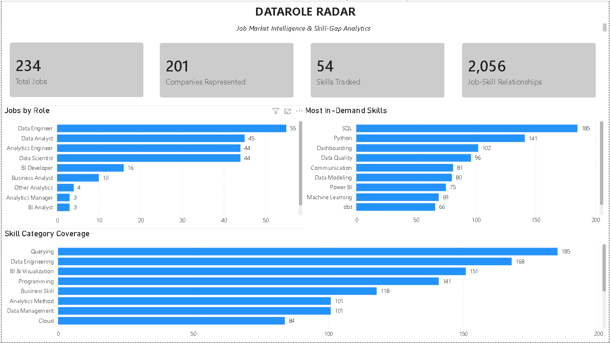
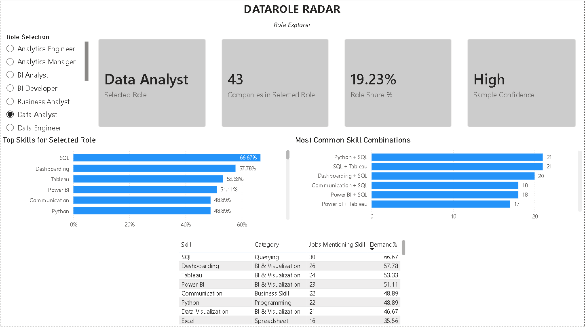
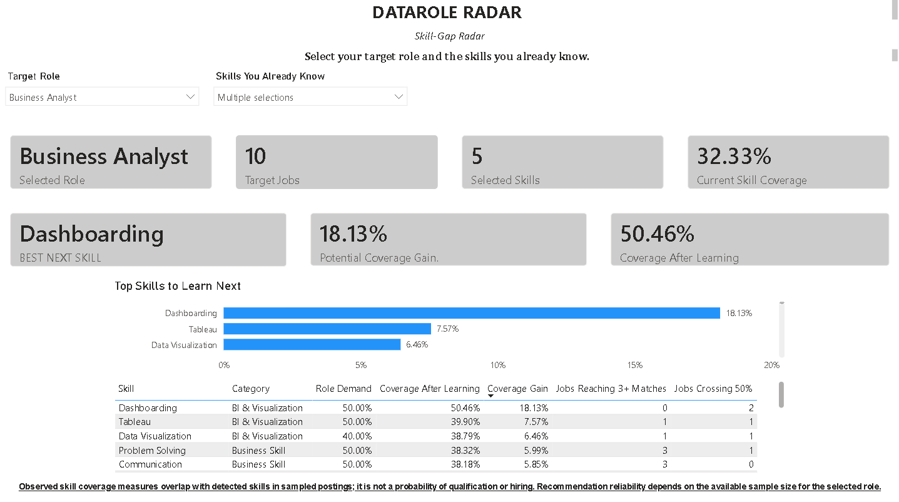
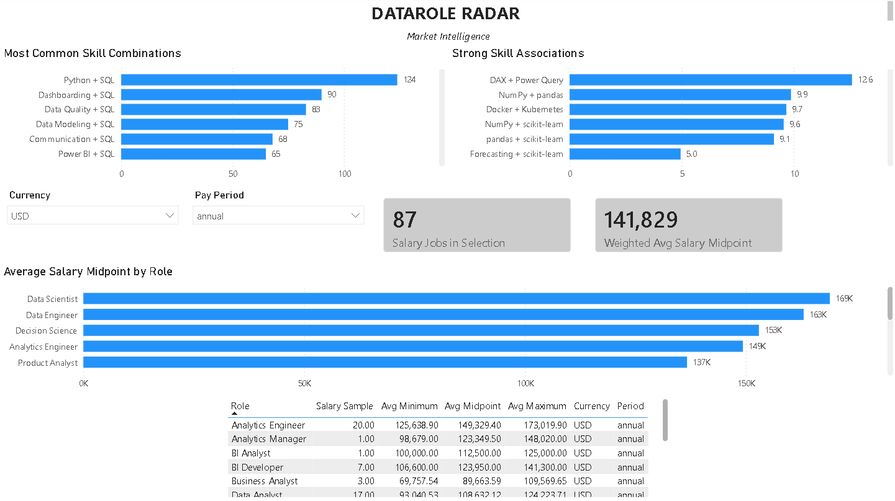
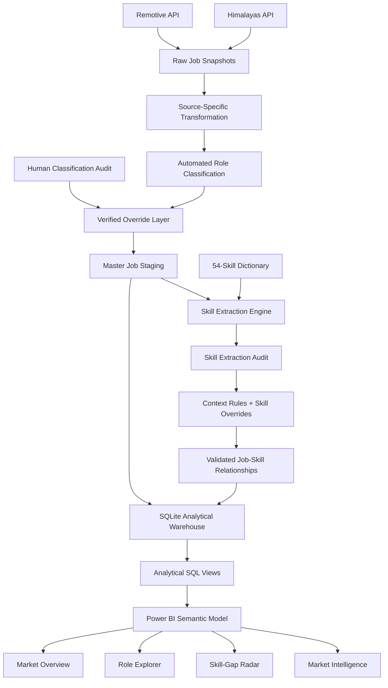

# DataRole Radar

### Automated Job Market Intelligence & Skill-Gap Analytics System

**DataRole Radar** is an end-to-end data analytics system that collects job postings, classifies data-related roles, extracts technical and business skills, validates data quality through human review, stores the resulting data in a relational SQLite warehouse, and transforms the data into interactive job-market intelligence using Power BI.

Its main differentiating feature is a **candidate-specific Skill-Gap Radar** that answers a practical question:

> **Given the role I want and the skills I already know, what should I learn next?**

Rather than simply ranking globally popular skills, DataRole Radar simulates how learning each missing skill would change a candidate's observed overlap with real job postings for a selected role.

---

## Repository

[View DataRole Radar on GitHub](https://github.com/The1016/DataRole-Radar--Automated-Job-Market-Intelligence-and-Skill-Gap-Analytics-System)

---

# Project Highlights

| Metric | Result |
|---|---:|
| Master job records collected | **337** |
| Target data-role postings | **234** |
| Companies represented | **201** |
| Canonical skills tracked | **54** |
| Job-skill relationships | **2,056** |
| Jobs with detected skills | **230 / 234** |
| Skill extraction coverage | **98.29%** |
| Average detected skills per job | **8.79** |
| Role classifier precision | **95.65%** |
| Role classifier recall | **84.62%** |
| Role classifier F1 | **89.80%** |
| Automated tests | **35 passing** |

> The classifier metrics come from a manually reviewed audit set deliberately enriched with ambiguous and suspicious classifications. They should not be interpreted as an unbiased estimate of accuracy across the entire collected dataset.

---

# Table of Contents

- [Dashboard](#dashboard)
- [Why I Built This](#why-i-built-this)
- [System Architecture](#system-architecture)
- [Data Sources](#data-sources)
- [Data Pipeline](#data-pipeline)
- [Role Classification](#role-classification)
- [Human-in-the-Loop Validation](#human-in-the-loop-validation)
- [Skill Extraction](#skill-extraction)
- [Skill Extraction Quality Assurance](#skill-extraction-quality-assurance)
- [SQLite Analytical Warehouse](#sqlite-analytical-warehouse)
- [Analytical SQL Layer](#analytical-sql-layer)
- [Skill Co-Occurrence and Lift](#skill-co-occurrence-and-lift)
- [Skill-Gap Recommendation Engine](#skill-gap-recommendation-engine)
- [Recommendation Stress Testing](#recommendation-stress-testing)
- [Automated Testing](#automated-testing)
- [Technology Stack](#technology-stack)
- [Project Structure](#project-structure)
- [Installation](#installation)
- [Running the Project](#running-the-project)
- [Reproducibility](#reproducibility)
- [Limitations](#limitations)
- [Future Improvements](#future-improvements)
- [Author](#author)

---

# Dashboard

The final Power BI report is divided into four pages, each answering a different analytical question.

---

## 1. Market Overview

The Market Overview provides a high-level picture of the collected job-market sample.

It includes:

- total target job postings
- companies represented
- skills tracked
- job-skill relationships
- job distribution by role
- most in-demand skills
- skill-category coverage



The purpose of this page is to answer:

> **What does the collected data-job market look like overall?**

---

## 2. Role Explorer

The Role Explorer allows users to select a specific job family and examine the market requirements for that role.

It includes:

- sampled postings for the selected role
- companies represented
- role share within the dataset
- sample-confidence indicator
- most demanded skills
- skill-demand percentages
- most common role-specific skill combinations



For example, within the collected **Data Analyst** sample:

| Skill | Share of Data Analyst postings |
|---|---:|
| SQL | **66.67%** |
| Dashboarding | **57.78%** |
| Tableau | **53.33%** |
| Power BI | **51.11%** |
| Python | **48.89%** |
| Communication | **48.89%** |

These percentages describe the collected DataRole Radar sample rather than the entire global labor market.

---

## 3. Skill-Gap Radar

The Skill-Gap Radar is the main differentiating feature of the project.

Users select:

1. a target role
2. the skills they already know

The system then calculates their current **Observed Skill Coverage** and evaluates every missing skill through a what-if simulation.



### Example

Suppose the target role is:

```text
Data Analyst
```

and the candidate already knows:

```text
SQL
Excel
Power BI
Python
```

The engine calculates:

```text
Current Observed Skill Coverage:
29.00%
```

It then simulates adding every missing skill individually.

For example:

```text
Recommended Next Skill:
Dashboarding

Coverage After Learning:
37.05%

Marginal Coverage Gain:
+8.05 percentage points
```

Supporting evidence includes:

- role-specific skill demand
- coverage after learning the skill
- marginal coverage gain
- jobs newly reaching three matched skills
- jobs newly crossing 50% observed skill coverage

> Observed Skill Coverage measures overlap with extracted skills in sampled job postings. It is **not** a probability of being hired, qualified, interviewed, or shortlisted.

---

## 4. Market Intelligence

The Market Intelligence page examines relationships that are not visible from simple skill-frequency rankings.

It includes:

- most common skill combinations
- skill-pair co-occurrence
- strong skill associations
- association lift
- salary observations by role
- salary comparison within consistent currency and pay-period groups



This page intentionally distinguishes between:

> **Skills that frequently appear together**

and

> **Skills that appear together more often than expected**

These are not necessarily the same thing.

---

# Why I Built This

Many portfolio job-market projects stop after answering questions such as:

> What are the most popular skills?

or:

> Which data roles appear most often?

Those questions are useful, but they do not directly help someone decide what to learn next.

DataRole Radar was designed around a more actionable question:

> **Given my current skill set and my target role, which missing skill would provide the greatest improvement in my observed fit with current job postings?**

Answering that required more than building a dashboard.

The project required:

```text
API ingestion
→ data cleaning
→ role taxonomy design
→ automated classification
→ human QA
→ skill extraction
→ context-aware rule refinement
→ relational database modeling
→ SQL analytics
→ recommendation logic
→ automated testing
→ Power BI visualization
```

---

# System Architecture



---

# Data Sources

DataRole Radar currently combines job postings from two public remote-job sources.

## Himalayas

Himalayas provides the majority of the target-role records.

The extractor uses bounded pagination across targeted search queries such as:

```text
data analyst
business intelligence
power bi
data scientist
data engineer
analytics engineer
```

The extraction system records source-page lineage and prevents repeated-page loops.

---

## Remotive

Remotive provides a second source of remote job postings.

Although it contributes fewer target data-role records, it provides:

- source diversification
- cross-source reconciliation
- additional testing of the shared transformation pipeline

---

# Data Pipeline

The system follows a staged ETL/ELT workflow.

```text
API Extraction
      ↓
Raw Source Snapshots
      ↓
Source-Specific Transformation
      ↓
Role Classification
      ↓
Human Audit + Overrides
      ↓
Master Job Staging
      ↓
Skill Extraction
      ↓
Human Skill Audit
      ↓
Context-Aware Refinement
      ↓
Validated Job-Skill Relationships
      ↓
SQLite Analytical Warehouse
      ↓
Analytical SQL Views
      ↓
Power BI
```

Important lineage fields are preserved throughout the process, including:

```text
source
source_job_id
source_record_key
fingerprint
search_queries
collected_at
```

This makes records traceable from the dashboard back to their source-system representation.

---

# Role Classification

Job titles are inconsistent across employers.

A role such as:

```text
Business Intelligence Engineer
```

may be closer to analytics engineering at one company and BI development at another.

To improve consistency, DataRole Radar uses a shared rule-based taxonomy.

Supported role families include:

```text
Data Analyst
BI Analyst
BI Developer
Business Analyst
Reporting Analyst
Insights Analyst
Product Analyst
Marketing Analyst
Operations Analyst
Decision Science
Data Scientist
Data Engineer
Analytics Engineer
Machine Learning
Analytics Manager
Other Analytics
Non-target Role
```

The classifier first assigns an automated role family.

Verified manual decisions can then override that classification.

Classification provenance is retained through fields such as:

```text
automated_role_family
role_family
classification_method
role_override_applied
override_decision
is_target_data_role
```

---

# Human-in-the-Loop Validation

Automated classification was not treated as automatically correct.

A targeted audit was created for suspicious and ambiguous records.

Human review decisions included:

```text
Correct
False Positive
False Negative
Incorrect Role Family
Needs New Category
Unverified
```

Verified corrections were stored separately and applied as an override layer after automated classification.

This preserves automation while allowing known edge cases to be corrected without hard-coding them into every transformation step.

---

## Classifier Evaluation

The reviewed audit set produced:

| Metric | Result |
|---|---:|
| Precision | **95.65%** |
| Recall | **84.62%** |
| F1 Score | **89.80%** |

The audit set was intentionally enriched with questionable cases, so these results should be interpreted as evaluation of the classifier on difficult reviewed examples rather than as a global accuracy estimate.

---

# Skill Extraction

A canonical dictionary containing **54 skills** powers the skill extraction system.

The dictionary covers areas such as:

```text
Programming
Querying
BI & Visualization
Data Engineering
Cloud Platforms
Databases
Data Platforms
Analytics Methods
Python Libraries
Developer Tools
Business Skills
Data Management
```

Examples include:

```text
SQL
Python
R
Excel
Power BI
Tableau
Looker
Qlik
DAX
Power Query
Microsoft Fabric
Dashboarding
Data Visualization
pandas
NumPy
scikit-learn
dbt
ETL / ELT
Airflow
Spark
Databricks
Snowflake
BigQuery
Redshift
PostgreSQL
MySQL
SQL Server
AWS
Azure
GCP
Statistics
Forecasting
A/B Testing
Machine Learning
Data Governance
Data Quality
Git
Jira
Stakeholder Management
Communication
Problem Solving
Business Acumen
```

Every extracted relationship retains evidence information.

The job-skill bridge includes fields such as:

```text
source_record_key
skill_key
evidence_source
matched_aliases
evidence_field_count
```

---

# Skill Extraction Quality Assurance

The first extraction pass produced:

```text
2,096 job-skill relationships
```

Instead of accepting these results directly, a targeted manual audit was performed.

The audit focused on:

- ambiguous aliases
- jobs with unusually high skill counts
- postings with no detected skills
- contextual false positives

Several systematic issues were discovered.

---

## URL-Based False Positives

A Spark documentation URL containing text similar to:

```text
/docs/latest/api/python/
```

could incorrectly generate an `API` skill match.

The extractor was therefore updated to remove URLs before skill matching.

---

## Education-Based Statistics Matches

A requirement such as:

```text
Bachelor's degree in Data Science, Statistics, Computer Science...
```

does not necessarily mean that applied Statistics is a required working skill.

Education-only context was therefore suppressed for Statistics matching.

---

## Machine Learning Context

Some postings discussed machine-learning systems or products without requiring candidates to perform machine-learning work.

Machine Learning matching was therefore made more context-sensitive.

---

## A/B Testing Context

Generic references to experimentation were not automatically treated as evidence of explicit A/B Testing competency.

More restrictive matching rules were introduced.

---

## Final Skill Extraction Results

After QA and refinement:

| Metric | Result |
|---|---:|
| Target jobs | **234** |
| Canonical skills | **54** |
| Job-skill relationships | **2,056** |
| Jobs with detected skills | **230** |
| Jobs without detected skills | **4** |
| Skill detection coverage | **98.29%** |
| Average skills per job | **8.79** |

Top detected skills included:

| Skill | Jobs |
|---|---:|
| SQL | **185** |
| Python | **141** |
| Dashboarding | **102** |
| Data Quality | **96** |
| Communication | **81** |
| Data Modeling | **80** |
| Power BI | **75** |
| Machine Learning | **69** |
| Tableau | **66** |
| dbt | **66** |
| Data Warehousing | **64** |
| Snowflake | **61** |
| Data Visualization | **61** |

---

# SQLite Analytical Warehouse

The validated analytical data is loaded into a relational SQLite warehouse.

Core tables include:

```text
sources
jobs
skills
job_skills
pipeline_runs
```

The core relationship is:

```text
jobs
  1
  │
  │
  *
job_skills
  *
  │
  │
  1
skills
```

`job_skills` acts as the many-to-many bridge connecting postings with canonical skills.

---

## Warehouse Validation

The warehouse build process checks:

- primary keys
- composite-key uniqueness
- foreign keys
- source reconciliation
- schema consistency
- orphan relationships
- expected analytical views
- SQLite integrity

The database is built using a temporary file.

Only after all validation succeeds does the process replace the production database.

This prevents a failed pipeline execution from replacing a valid warehouse.

---

# Analytical SQL Layer

Reusable analytical views are defined in:

```text
sql/analytical_views.sql
```

The SQLite warehouse automatically deploys these views during each database build.

Current views include:

```text
vw_skill_demand
vw_role_summary
vw_role_skill_demand
vw_skill_cooccurrence
vw_role_skill_cooccurrence
vw_salary_by_role
```

Additional analytical queries are maintained separately in:

```text
sql/analysis_queries.sql
```

This separates reusable warehouse logic from interactive analytical exploration.

---

# Skill Co-Occurrence and Lift

Simple frequency alone cannot fully describe relationships between skills.

For example, SQL appears in many postings, so it will naturally co-occur with many other skills.

DataRole Radar therefore calculates both:

```text
co-occurrence frequency
```

and:

```text
association strength
```

Metrics include:

- co-occurrence job count
- pair job share
- directional conditional probability
- Jaccard similarity
- lift

---

## Lift

Lift compares observed co-occurrence with what would be expected from the individual prevalence of two skills.

Conceptually:

```text
Lift > 1
```

means:

> The two skills appear together more often than expected if they were independent.

Minimum-support filters are used when ranking strong associations because very rare combinations can otherwise generate unstable lift values.

---

# Skill-Gap Recommendation Engine

The official recommendation methodology is based on **Marginal Coverage Gain**.

The system does not assign arbitrary manual weights to skills.

Instead, it performs posting-level what-if simulations.

For a selected role:

```text
1. Identify all target-role postings
2. Identify the candidate's known skills
3. Calculate current matched skills for every posting
4. Calculate current observed skill coverage
5. Identify every missing skill
6. Add each missing skill individually
7. Recalculate average coverage
8. Measure the marginal improvement
9. Rank skills by improvement
```

---

## Observed Skill Coverage

For each analyzable posting:

```text
Observed Skill Coverage
=
Matched Candidate Skills
────────────────────────
Detected Skills in the Posting
```

The candidate's baseline is the average posting-level coverage across all analyzable postings.

Jobs with zero matched skills correctly contribute:

```text
0%
```

rather than being silently excluded from the average.

Postings with no detected skills are excluded because coverage cannot be calculated for them.

---

## Marginal Coverage Gain

For every missing skill:

```text
Marginal Coverage Gain
=
Coverage After Learning Skill
-
Current Observed Skill Coverage
```

This gives the recommendation a direct interpretation:

> **How much would the candidate's average observed skill overlap improve if this skill were added?**

---

## Supporting Recommendation Metrics

The system also calculates:

```text
Role Demand
Coverage After Learning
Jobs Newly Reaching 3+ Matches
Jobs Newly Crossing 50% Coverage
```

These help explain *why* a recommendation ranks highly instead of presenting an unexplained score.

---

# Recommendation Stress Testing

The recommendation engine was tested across different target roles and candidate profiles.

---

## Data Analyst

Known skills:

```text
SQL
Excel
Power BI
Python
```

Baseline coverage:

```text
29.00%
```

Top recommendations included:

| Skill | Marginal Gain |
|---|---:|
| Dashboarding | **+8.05 pts** |
| Tableau | **+7.57 pts** |
| Data Quality | **+6.78 pts** |
| Communication | **+6.69 pts** |
| Data Visualization | **+6.41 pts** |

---

## Data Engineer

Known skills:

```text
SQL
Python
AWS
```

Top recommendations included:

```text
Data Quality
ETL / ELT
Data Modeling
Data Warehousing
dbt
Snowflake
Spark
Airflow
```

---

## Data Scientist

Known skills:

```text
Python
SQL
Machine Learning
```

Top recommendations included:

```text
Statistics
Forecasting
Communication
scikit-learn
pandas
Spark
```

---

## Analytics Engineer

Known skills:

```text
SQL
dbt
Snowflake
```

Top recommendations included:

```text
Python
Dashboarding
Data Modeling
Data Quality
Data Warehousing
Looker
Communication
Tableau
```

---

## BI Developer

Known skills:

```text
SQL
Power BI
Excel
```

Top recommendations included:

```text
Dashboarding
Data Modeling
DAX
Problem Solving
Python
SQL Server
Data Visualization
Data Warehousing
ETL / ELT
```

These results demonstrate that the engine responds to the structure of each role rather than returning the same globally popular skills for every candidate.

---

# Sample Confidence

Recommendation reliability depends partly on the number of postings available for a role.

A simple sample-volume indicator is therefore used:

```text
30+ postings     → Higher confidence
15–29 postings   → Moderate confidence
Below 15         → Limited confidence
```

This is a descriptive sample-size label.

It is **not** a statistical confidence interval.

---

# Salary Analysis

Salary analysis is handled separately from general job counts because compensation records may differ by:

- currency
- pay period
- disclosure availability

Salary comparisons are therefore restricted to compatible combinations such as:

```text
USD
Annual
```

The dashboard reports:

- salary sample size
- average minimum salary
- average midpoint salary
- average maximum salary

Salary observations reflect only postings that disclosed compensation in the collected dataset.

---

# Automated Testing

The project currently includes **35 automated tests**.

Coverage includes:

```text
Role classification
Historical role overrides
Master staging integrity
Skill extraction
URL false-positive prevention
Education-context filtering
A/B Testing rules
Machine Learning context
Skill overrides
Job-skill uniqueness
Valid skill keys
Foreign-key integrity
Warehouse validation
```

Run the full suite with:

```bash
python -m pytest tests -v
```

Expected result:

```text
35 passed
```

---

# Technology Stack

| Layer | Technology |
|---|---|
| Programming | Python |
| Data Processing | pandas |
| API Requests | requests |
| HTML Parsing | BeautifulSoup |
| Database | SQLite |
| Query Language | SQL |
| Testing | pytest |
| Data Modeling | Power BI |
| Visualization | Microsoft Power BI |
| Version Control | Git / GitHub |

---

# Project Structure

```text
DataRole-Radar/
│
├── data/
│   └── reference/
│       ├── skill_dictionary.csv
│       └── role_classification_overrides.csv
│
├── database/
│
├── docs/
│   └── screenshots/
│       ├── 01_market_overview.png
│       ├── 02_role_explorer.png
│       ├── 03_skill_gap_radar.png
│       └── 04_market_intelligence.png
│
├── notebooks/
│
├── powerbi/
│
├── reports/
│
├── sql/
│   ├── analytical_views.sql
│   └── analysis_queries.sql
│
├── src/
│   ├── extract/
│   ├── load/
│   ├── quality/
│   └── transform/
│
├── tests/
│
├── .gitattributes
├── .gitignore
├── requirements.txt
└── README.md
```

Raw job-posting snapshots, generated processed datasets, SQLite database files, virtual environments, and working Power BI files containing imported source data are intentionally excluded from version control.

---

# Installation

Clone the repository:

```bash
git clone https://github.com/The1016/DataRole-Radar--Automated-Job-Market-Intelligence-and-Skill-Gap-Analytics-System.git
```

Move into the project directory:

```bash
cd DataRole-Radar--Automated-Job-Market-Intelligence-and-Skill-Gap-Analytics-System
```

Create a virtual environment:

```bash
python -m venv .venv
```

Activate it on Windows PowerShell:

```powershell
Set-ExecutionPolicy -Scope Process -ExecutionPolicy Bypass
.\.venv\Scripts\Activate.ps1
```

Install dependencies:

```bash
pip install -r requirements.txt
```

---

# Running the Project

The pipeline is divided into extraction, transformation, quality-control, and loading stages.

Typical transformation stages include:

```bash
python -m src.transform.build_remotive_staging
python -m src.transform.build_himalayas_staging
python -m src.transform.build_master_staging
python -m src.transform.extract_job_skills
```

Build the analytical warehouse:

```bash
python -m src.load.build_sqlite_warehouse
```

Run the complete automated test suite:

```bash
python -m pytest tests -v
```

---

# Reproducibility

The public repository contains the components necessary to understand and reproduce the analytical methodology, including:

- extraction logic
- transformation code
- role taxonomy
- manual classification overrides
- skill dictionary
- skill extraction logic
- QA scripts
- SQL analytical views
- tests
- dashboard documentation

Raw and processed job-posting datasets are intentionally not included.

This keeps generated third-party content separate from the source-controlled analytical system.

To reproduce the pipeline, users should collect fresh records from the supported sources and run the transformation workflow locally.

---

# Data Interpretation

DataRole Radar analyzes a **targeted collected sample**.

Results should therefore be interpreted as:

> Share of postings in the collected DataRole Radar dataset

rather than:

> Share of every data-related job in the global labor market

This distinction is especially important when interpreting:

- role distribution
- skill demand
- salary statistics
- skill combinations
- recommendation outputs

---

# Limitations

The project has several important limitations.

### Limited job sources

The current system uses:

```text
Himalayas
Remotive
```

Additional sources could improve coverage.

### Targeted search strategy

The dataset is generated using selected search queries and bounded pagination.

Role proportions therefore reflect the collection strategy.

### Rule-based skill extraction

The extractor is auditable and explainable, but it may miss:

- implicit skills
- unusual terminology
- highly contextual requirements

### Salary disclosure

Only a subset of postings contain usable salary information.

Salary results therefore represent disclosed compensation rather than the full job sample.

### Small role samples

Some job families contain relatively few postings.

Recommendations for these roles should be interpreted with greater caution.

### Skill overlap is not employability

Observed Skill Coverage does not account for:

- years of experience
- degree requirements
- industry knowledge
- seniority
- communication quality
- portfolio quality
- interview performance
- location restrictions
- work authorization
- hiring preferences

It should therefore be interpreted as **skill-overlap evidence**, not hiring probability.

---

# Future Improvements

Potential future extensions include:

- scheduled automated collection
- historical skill-demand trends
- more job-market sources
- geography-aware analytics
- improved seniority classification
- NLP-assisted role classification
- embedding-assisted skill extraction
- skill ontology relationships
- experience requirement extraction
- salary normalization
- resume ingestion
- candidate-profile persistence
- web-based Skill-Gap Radar
- automated Power BI refresh
- emerging-skill detection
- market-change alerts

---

# What This Project Demonstrates

DataRole Radar combines multiple areas of practical data work:

```text
API ingestion
        ↓
Data cleaning
        ↓
ETL / ELT
        ↓
Taxonomy design
        ↓
Classification
        ↓
Human-in-the-loop QA
        ↓
Skill extraction
        ↓
Relational data modeling
        ↓
SQL analytics
        ↓
Automated testing
        ↓
Recommendation logic
        ↓
Business intelligence
```

The project was designed to move beyond descriptive dashboards and turn job-market data into **actionable learning recommendations**.

---

# Author

**MD Zawwadul Islam**  
**BS CSE**

Data Analytics Portfolio Project

GitHub: [The1016](https://github.com/The1016)

---

## Repository

**DataRole Radar — Automated Job Market Intelligence and Skill-Gap Analytics System**

https://github.com/The1016/DataRole-Radar--Automated-Job-Market-Intelligence-and-Skill-Gap-Analytics-System